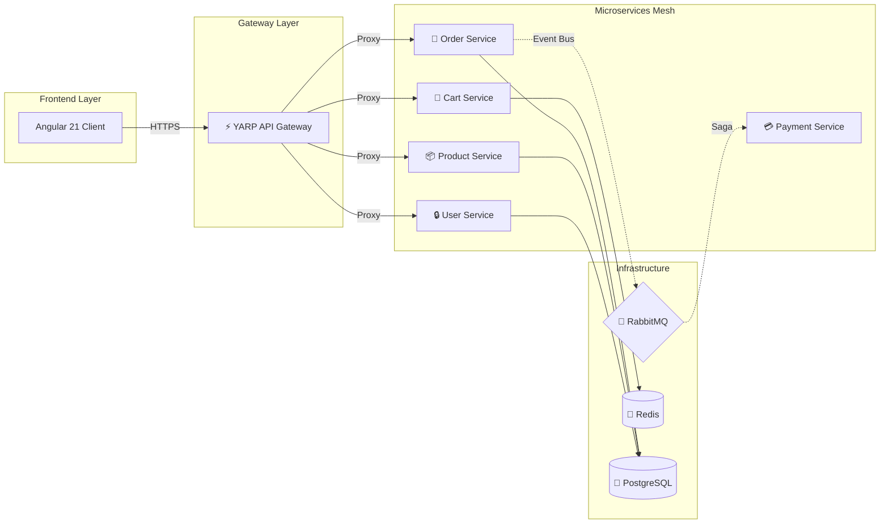

# 🚀 .NET 10 Microservices & Angular 21 E-Commerce Suite


Welcome to our **Enterprise-Grade E-Commerce Showcase**. This repository demonstrates a full-stack, distributed system built with the latest technologies, focusing on scalability, observability, and architecture.

---

## 🏗️ The Big Picture

This monorepo bridges a high-performance **.NET 10 Microservices Backend** with a modern **Angular 21 (Zoneless) Frontend**. 



---

## 🌟 Core Components

Explore the specialized folders for deep dives into implementation details:

### 📦 [Backend: E-Commerce Platform](./apps/ecommerce-platform)
A distributed system consisting of 7 microservices using **MassTransit**, **RabbitMQ**, and **clean architecture**. 
- **Tech**: .NET 10, EF Core, Redis, PostgreSQL, OpenTelemetry, Jaeger.
- **Cool Feature**: Full Saga orchestration for order processing.

### 🎨 [Frontend: E-Commerce Web App](./apps/ecommerce-frontend)
A reactive, high-performance UI built with **Angular 21** and **NgRx Signals**.
- **Tech**: TailwindCSS v4, PrimeNG v21, Signals, Vitest.
- **Cool Feature**: Fully Zoneless architecture for maximum performance.

---

## 🚀 Quick Start (Whole Stack)

The easiest way to see everything in action is via Docker.

### Prerequisites
- [Docker Desktop](https://www.docker.com/products/docker-desktop/) installed.

### Launch
```powershell
docker-compose -f apps/ecommerce-platform/docker-compose.yml up -d --build
```

### Main Entry Points
| Component | URL | Creds |
| :--- | :--- | :--- |
| **Frontend UI** | [http://localhost:4200](http://localhost:4200) | Guest |
| **API Gateway (Docs)** | [http://localhost:5000/api-docs](http://localhost:5000/api-docs) | N/A |
| **Jaeger (Traces)** | [http://localhost:16686](http://localhost:16686) | N/A |
| **Seq (Logs)** | [http://localhost:8091](http://localhost:8091) | `admin` / `password` |

---

## 🧠 Why this Architecture?

- **Gateway Pattern**: The frontend only ever talks to YARP (Port 5000). This handles CORS, Authentication, and Rate Limiting in one place.
- **Zoneless Angular**: We use Signals to manage change detection, removing the overhead of `zone.js`.
- **Event-Driven Resilience**: Services communicate asynchronously via RabbitMQ, ensuring that a spike in orders doesn't crash the UI.
- **Deep Observability**: Every click in the Angular app can be traced through to the database via OpenTelemetry and Jaeger.

---

**My Senior Project Showcase** - Crafted by ❤️ by Stanley Morales
