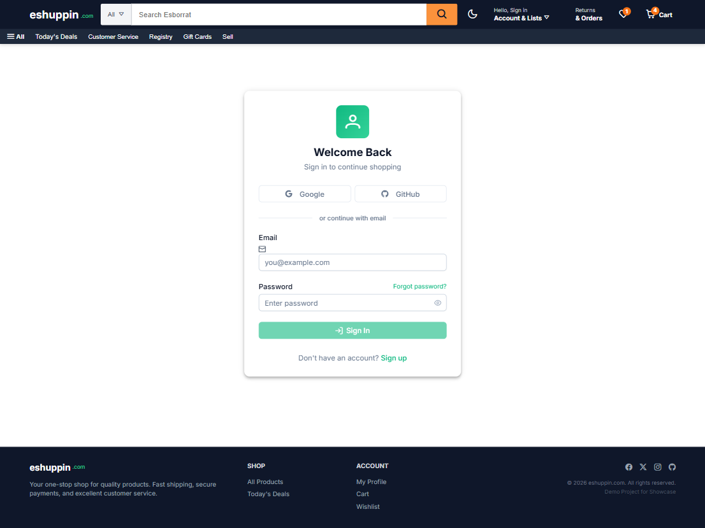
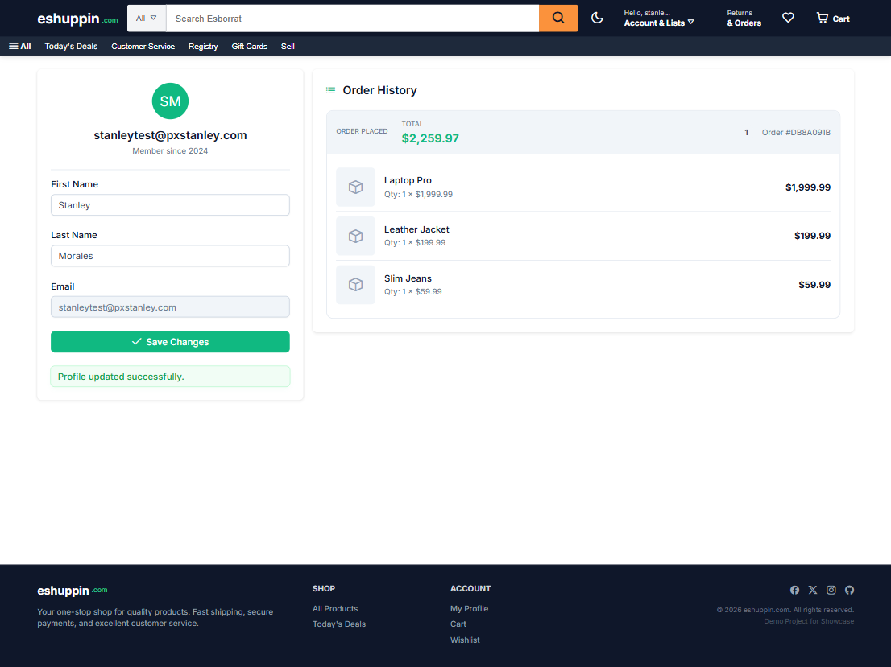
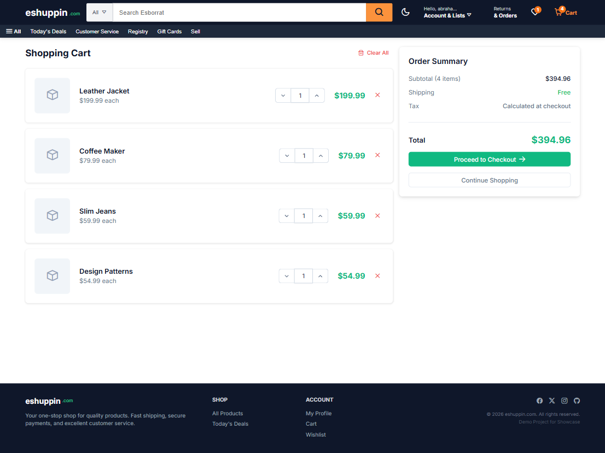
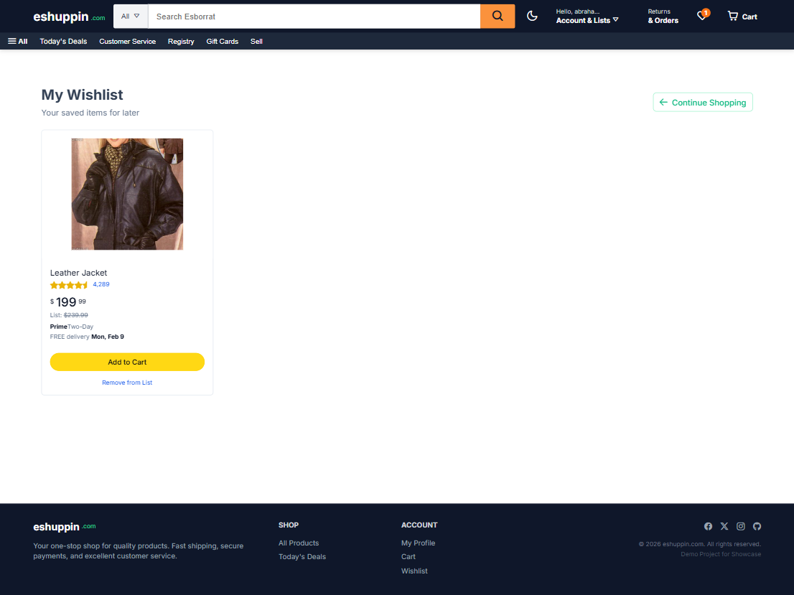

# 🛒 Ecommerce Frontend (Angular 21 + Signals)


A high-performance, enterprise-grade e-commerce frontend built with **Angular 21**. This project demonstrates modern "Senior-Level" architecture using **Signals**, **Clean Architecture**, and **SOLID principles**.

## 🚀 Key Features
- **Modern State Management**: Powered entirely by `@ngrx/signals`.
- **Clean Architecture**: Strict separation between **UI** (Components), **State** (Stores), and **Infrastructure** (Services).
- **Performance First**: Zero-config lazy loading, standalone components, and optimized build.
- **Dumb/Smart Component Pattern**: Reusable UI components (`shared/ui`) decoupled from domain logic.
- **Robust Typing**: Strict TypeScript configuration.







## 🏗️ Architecture

The application follows a unidirectional data flow with a clear separation of concerns.

```mermaid
graph TD
    subgraph UI [User Interface]
        SmartComp[Smart Component (Container)]
        DumbComp[Dumb Component (Presentation)]
    end

    subgraph State [Application State]
        Store[Signal Store]
    end

    subgraph Infra [Infrastructure]
        Service[Data Service]
        API[External API]
    end

    SmartComp -->|Events| Store
    SmartComp -->|Inputs| DumbComp
    DumbComp -->|Events| SmartComp
    Store -->|Calls| Service
    Service -->|HTTP| API
    Store -->|Signals| SmartComp
```

- **Smart Components**: (`ProductListComponent`, `ProductDetailsComponent`) Manage state injections and handle events.
- **Dumb Components**: (`ProductCardComponent`) Purely presentation; data in, events out.
- **Signal Stores**: (`CartStore`, `CatalogStore`) Manage application state and business logic.
- **Services**: (`CartService`) Handle raw HTTP communication and DTO mapping.

## 🛠️ Tech Stack
- **Framework**: Angular 21 (Zero-Zone compatible)
- **State**: NgRx Signals (Lightweight, Boilerplate-free)
- **Styling**: TailwindCSS v4 + PrimeNG v21 (Aura Theme)
- **Testing**: Vitest + Angular Testing Library
- **Tooling**: Vite (Dev Server), ESLint, Prettier

## 🚦 Getting Started

### Prerequisites
- Node.js v20+
- npm v10+

### Installation
```bash
git clone https://github.com/AbStanley/ecommerce-frontend.git
cd ecommerce-frontend
npm install
```

### Development
Start the dev server with hot reload:
```bash
ng serve
# Access at http://localhost:4200
```

### Testing
Run unit tests with Vitest:
```bash
ng test
```

### Production Build
Generate the optimized bundle:
```bash
ng build
# Output: dist/ecommerce-frontend
```

## 📂 Project Structure
```plaintext
src/app/
├── core/           # Singleton services, Interceptors, Guards
├── features/       # Domain features (Catalog, Cart, Auth)
│   ├── catalog/
│   │   ├── catalog.store.ts    # State
│   │   ├── catalog.service.ts  # Data Access
│   │   └── product-list.ts     # Smart Component
├── shared/         # Reusable artifacts
│   ├── models/     # Domain entities
│   └── ui/         # Dumb components (ProductCard, etc.)
└── app.config.ts   # Global providers
```

## 🤝 Contributing
1.  Fork the repo
2.  Create your feature branch (`git checkout -b feature/amazing-feature`)
3.  Commit your changes (`git commit -m 'feat: add amazing feature'`)
4.  Push to the branch (`git push origin feature/amazing-feature`)
5.  Open a Pull Request

---
**Senior Project Showcase** - Crafted with ❤️ by [Your Name]
