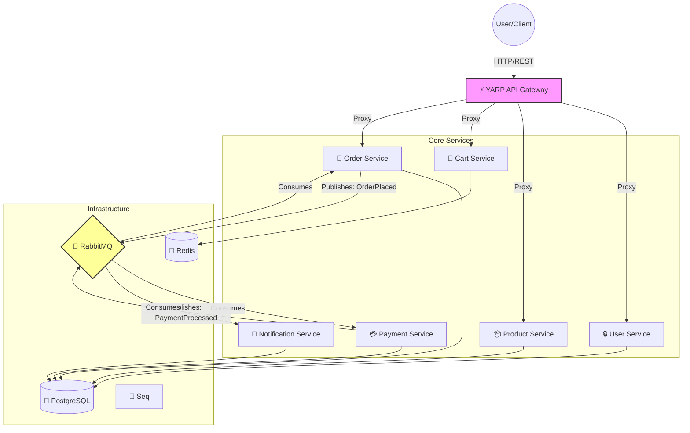

# 🛒 .NET 10 Microservices E-Commerce Platform


Welcome to the **E-Commerce Microservices Platform**, a state-of-the-art reference implementation built on **.NET 10**. This project demonstrates how to build a scalable, resilient, and enterprise-grade distributed system using modern best practices.

---

## 🏗️ High-Level Architecture

The system follows a **Clean Architecture** approach within each microservice, orchestrated by an **Event-Driven** backbone using RabbitMQ and MassTransit.



### 🧠 The Thinking Process
*   **Monorepo Strategy**: All services live in one repo for easier dependency management (`Shared` libraries) and unified CI/CD, while maintaining strict deployment isolation.
*   **Clean Architecture**: Each service is divided into `Domain` (Core), `Application` (Use Cases), `Infrastructure` (Db/Bus), and `API` (Entry). This ensures technology independence for the core logic.
*   **Resilience First**: Implemented **Polly** retries for Database and Message Bus failures. The system is designed to "self-heal" during transient outages.
*   **Observability**: Centralized logging via **Seq** and **Serilog** ensures you can trace a request from Gateway -> Service -> Database -> Event Bus -> Consumer in one view.

---

## 🛠️ Technology Stack

| Category | Technology | Usage |
| :--- | :--- | :--- |
| **Framework** | **.NET 10** | Latest performance features & C# 14 syntax. |
| **Containerization** | **Docker & Compose** | One-command startup for entire stack. |
| **Gateway** | **YARP** | High-performance reverse proxy & rate limiting. |
| **Database** | **PostgreSQL & EF Core** | Relational data with Code-First migrations. |
| **Caching** | **Redis** | High-speed shopping cart storage. |
| **Messaging** | **MassTransit (RabbitMQ)** | Robust event bus for async workflows. |
| **Auth** | **OpenIddict & JWT** | Secure OAuth2/OpenID Connect flow. |
| **Logging** | **Serilog & Seq** | Structured logging and centralization. |

---

## 🚀 Quick Start Guide

### Prerequisites
*   [Docker Desktop](https://www.docker.com/products/docker-desktop/) installed & running.
*   (Optional) [.NET 10 SDK](https://dotnet.microsoft.com/download) for local dev.

### One-Command Launch
Run the entire platform (Infrastructure + 7 Services) with:

```powershell
docker-compose -f apps/ecommerce-platform/docker-compose.yml up -d --build
```

> **First Run Note**: The `ecommerce-seq` container usually takes 10-20 seconds to initialize.

### 🔍 Access Points

| Component | URL | Credentials (if applicable) |
| :--- | :--- | :--- |
| **API Gateway** | [http://localhost:5000](http://localhost:5000) | N/A |
| **Health Check** | [http://localhost:5000/health](http://localhost:5000/health) | N/A |
| **Seq Logs** | [http://localhost:8091](http://localhost:8091) | `admin` / `password` |
| **RabbitMQ** | [http://localhost:15672](http://localhost:15672) | `guest` / `guest` |

---

## 🔌 API Endpoints (Gateway)

All requests should be touted through the **Gateway (Port 5000)**.

### **User Service**
*   `POST /api/users/register` - Create a new account.
*   `POST /api/users/login` - Get Access Token.

### **Product Service**
*   `GET /api/products` - List all products.
*   `POST /api/products` - Create product (Admin).

### **Cart Service**
*   `GET /api/cart/{userId}` - Get cart.
*   `POST /api/cart/{userId}/items` - Add item.

### **Order Service**
*   `POST /api/orders` - Submit an order (Triggers Saga).
*   `GET /api/orders` - View order history.

---

## 🧪 Development Workflow

### Building Locally
If you want to code without Docker:
```bash
dotnet build apps/ecommerce-platform/ECommercePlatform.sln
```

### Running Tests
Unit tests run automatically in CI, but you can trigger them manually:
```bash
dotnet test apps/ecommerce-platform/ECommercePlatform.sln
```

### CI/CD
*   Pipeline is defined in `.github/workflows/ci-cd.yml`.
*   Automatically builds, tests, and validates Docker images on every push to `main`.

---

## 📜 License
This project uses **MassTransit v8.3.6** (Apache 2.0) to remain fully open-source and free for production use.
