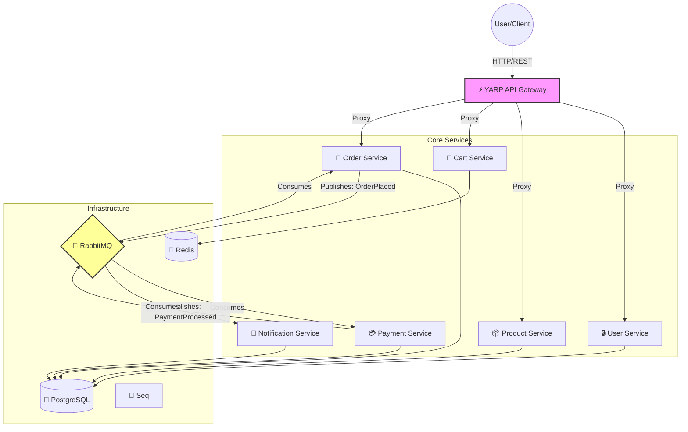

# 🛒 .NET 10 Microservices E-Commerce Platform


Welcome to the **E-Commerce Microservices Platform**, a state-of-the-art reference implementation built on **.NET 10**. This project demonstrates how to build a scalable, resilient, and enterprise-grade distributed system using modern best practices.


---

## 🏗️ High-Level Architecture

The system follows a **Clean Architecture** approach within each microservice, orchestrated by an **Event-Driven** backbone using RabbitMQ and MassTransit.



### 🧠 The Thinking Process
*   **Monorepo Strategy**: All services live in one repo for easier dependency management (`Shared` libraries) and unified CI/CD, while maintaining strict deployment isolation.
*   **Clean Architecture**: Each service is divided into `Domain` (Core), `Application` (Use Cases), `Infrastructure` (Db/Bus), and `API` (Entry). This ensures technology independence for the core logic.

*   **Resilience**: **Polly** Circuit Breakers (External), **EF Core** connection retries (Database), and **MassTransit** exponential backoff (Broker) for robust self-healing.
*   **Observability**: Integrated **OpenTelemetry** for distributed tracing. Every request across the 7-service mesh is traceable via **Jaeger**, complemented by structured logging with **Seq** and **Serilog**.
*   **Kubernetes Ready**: Complete set of K8s manifests including Deployments, Services, ConfigMaps, and Ingress for production-grade orchestration.

---

## 🛠️ Technology Stack

| Category | Technology | Usage |
| :--- | :--- | :--- |
| **Framework** | **.NET 10** | Latest performance features & C# 14 syntax. |
| **Containerization** | **Docker & Compose** | One-command startup for entire stack. |
| **Gateway** | **YARP** | High-performance reverse proxy & rate limiting. |
| **Database** | **PostgreSQL & EF Core** | Relational data with Code-First migrations. |
| **Caching** | **Redis** | High-speed shopping cart storage. |
| **Messaging** | **MassTransit (RabbitMQ)** | Robust event bus for async workflows. |
| **Auth** | **Custom JWT** | Secure implementation of Token-Based Auth. |
| **Logging** | **Serilog & Seq** | Structured logging and centralization. |

---

## 🚀 Quick Start Guide

### Prerequisites
*   [Docker Desktop](https://www.docker.com/products/docker-desktop/) installed & running.
*   (Optional) [.NET 10 SDK](https://dotnet.microsoft.com/download) for local dev.

### One-Command Launch
Run the entire platform (Infrastructure + 7 Services) with:

```powershell
docker-compose -f apps/ecommerce-platform/docker-compose.yml up -d --build
```

> **First Run Note**: The `ecommerce-seq` container usually takes 10-20 seconds to initialize.

### 🔍 Access Points

| Component | Base URL | Interactive Docs (Scalar) | Credentials |
| :--- | :--- | :--- | :--- |
| **API Gateway** | [http://localhost:5000](http://localhost:5000) | [Open Docs](http://localhost:5000/scalar/v1) | N/A |
| **User Service** | [http://localhost:5001](http://localhost:5001) | [Open Docs](http://localhost:5001/scalar/v1) | N/A |
| **Product Service** | [http://localhost:5002](http://localhost:5002) | [Open Docs](http://localhost:5002/scalar/v1) | N/A |
| **Cart Service** | [http://localhost:5003](http://localhost:5003) | [Open Docs](http://localhost:5003/scalar/v1) | N/A |
| **Order Service** | [http://localhost:5004](http://localhost:5004) | [Open Docs](http://localhost:5004/scalar/v1) | N/A |
| **Payment Service** | [http://localhost:5005](http://localhost:5005) | [Open Docs](http://localhost:5005/scalar/v1) | N/A |
| **Notify Service** | [http://localhost:5006](http://localhost:5006) | [Open Docs](http://localhost:5006/scalar/v1) | N/A |
| **Jaeger (Traces)** | [http://localhost:16686](http://localhost:16686) | [UI](http://localhost:16686) | N/A |
| **Seq Logs** | [http://localhost:8091](http://localhost:8091) | [Dashboard](http://localhost:8091) | `admin` / `password` |
| **RabbitMQ** | [http://localhost:15672](http://localhost:15672) | [Dashboard](http://localhost:15672) | `guest` / `guest` |

> **📖 Aggregated API Documentation**: Access **all** microservice APIs from a single page at [**http://localhost:5000/api-docs**](http://localhost:5000/api-docs)

---

## Frontend Developer Guide

> **TL;DR**: Your `API_BASE_URL` is always `http://localhost:5000`. You never need to know the other ports exist.

### How the Gateway Works

```
Your Frontend App (React/Angular/Vue)
        │
        ▼
   localhost:5000  ← API Gateway (the only URL you need)
        │
        ├─── /api/auth/*        → User Service
        ├─── /api/users/*       → User Service
        ├─── /api/products/*    → Product Service
        ├─── /api/cart/*        → Cart Service
        ├─── /api/orders/*      → Order Service
        ├─── /api/payments/*    → Payment Service
        └─── /api/notifications/* → Notification Service
```

### Example Usage

```javascript
// ✅ CORRECT - All requests go through the Gateway
const API_BASE = 'http://localhost:5000';

await fetch(`${API_BASE}/api/auth/login`, { method: 'POST', body: credentials });
await fetch(`${API_BASE}/api/products`);
await fetch(`${API_BASE}/api/cart/${userId}/items`, { method: 'POST', body: item });
```

### Why Use the Gateway?

| Benefit | Description |
|---------|-------------|
| **Single endpoint** | Only one URL to configure in your app |
| **Authentication** | JWT validation happens at the Gateway |
| **CORS** | Configured once at the Gateway |
| **Production-ready** | In production, only the Gateway is exposed to the internet |

> ⚠️ The individual service ports (5001-5006) are exposed in Docker for **debugging only**. Never use them in your frontend code.

---

## 🔌 API Endpoints

### **User Service**
*   `POST /api/auth/register` - Create a new account.
*   `POST /api/auth/login` - Get Access Token.

### **Product Service**
*   `GET /api/products` - List all products.
*   `POST /api/products` - Create product (Admin).

### **Cart Service**
*   `GET /api/cart/{userId}` - Get cart.
*   `POST /api/cart/{userId}/items` - Add item.

### **Order Service**
*   `POST /api/orders` - Submit an order (Triggers Saga).
*   `GET /api/orders` - View order history.

---

## 🧪 Development Workflow

### Building Locally
If you want to code without Docker:
```bash
dotnet build apps/ecommerce-platform/ECommercePlatform.sln
```

### Running Tests
Unit tests run automatically in CI, but you can trigger them manually:
```bash
dotnet test apps/ecommerce-platform/ECommercePlatform.sln
```

### CI/CD
*   Pipeline: defined in `.github/workflows/ci-cd.yml`.
*   Features:
    *   **Automated Testing**: Runs unit, integration, and E2E tests on every PR.
    *   **Code Coverage**: Integrated **Coverlet** reports shared via PR comments.
    *   **Docker Security**: Validates `docker-compose` and Dockerfiles.
    *   **Container Registry**: Automatically pushes tagged images to **GitHub Container Registry (ghcr.io)** on push to `main`.

---

## ☸️ Kubernetes Deployment

The project includes a full set of Kubernetes manifests for production-grade deployment found in the `k8s/` directory.

### Quick Deploy (Base)
1.  **Create Namespace**: `kubectl apply -f k8s/base/namespace.yaml`
2.  **Apply Configs**: `kubectl apply -f k8s/base/configmap.yaml`
3.  **Setup Secrets**: 
    - Copy `k8s/base/secrets.yaml.template` to `k8s/base/secrets.yaml`.
    - Fill in actual secrets.
    - `kubectl apply -f k8s/base/secrets.yaml`
4.  **Deploy Services**: `kubectl apply -f k8s/services/`
5.  **Setup Ingress**: `kubectl apply -f k8s/ingress.yaml`

> [!TIP]
> Use a tool like **Helm** or **Kustomize** (available in the repo structure) for managing different environments (Dev/Staging/Prod).

---

---

## 🧪 Testing

The solution includes a comprehensive "Test Pyramid" ensuring quality at all levels.

### 1. Unit Tests (Business Logic)
Fast, isolated tests for Domain Entities and Application Handlers.
```bash
# Run all unit tests
dotnet test ECommercePlatform.sln --filter "FullyQualifiedName~UnitTests"
```

**New Projects Added**: 
- `PaymentService.UnitTests`
- `ProductCatalogService.UnitTests`
- `NotificationService.UnitTests`
- `UserService.UnitTests`

### 2. Integration Tests (Component Wiring)
Uses **Testcontainers** to spin up real PostgreSQL and RabbitMQ instances for testing API endpoints.
*   **Requirements**: Docker Desktop must be running.
*   **What it tests**: API Controllers -> Database/Broker interaction.
```bash
dotnet test apps/ecommerce-platform/tests/ECommerce.IntegrationTests
```

### 3. End-to-End (E2E) Tests (Full System Flow)
The golden path verification. These tests automatically:
1.  Spin up the **entire** microservices mesh (Gateway + 7 Services) using `docker compose`.
2.  Wait for the system to be healthy.
3.  Simulate a real user journey (Register -> Login -> Shop -> Checkout -> Order Confirmed).
4.  Tear down the environment.

```bash
# Verify the entire platform (takes ~2-3 mins)
dotnet test apps/ecommerce-platform/tests/ECommerce.E2E.Tests
```

> **Legacy/Manual Verification**: You can still use the PowerShell script for manual verification if preferred:
> ```powershell
> ./apps/ecommerce-platform/verify.ps1
> ```

### 🩺 Health Checks
Check the status of all services:
```bash
curl http://localhost:5000/health
```

---

## 📜 License
This project uses **MassTransit v8.3.6** (Apache 2.0) to remain fully open-source and free for production use.
